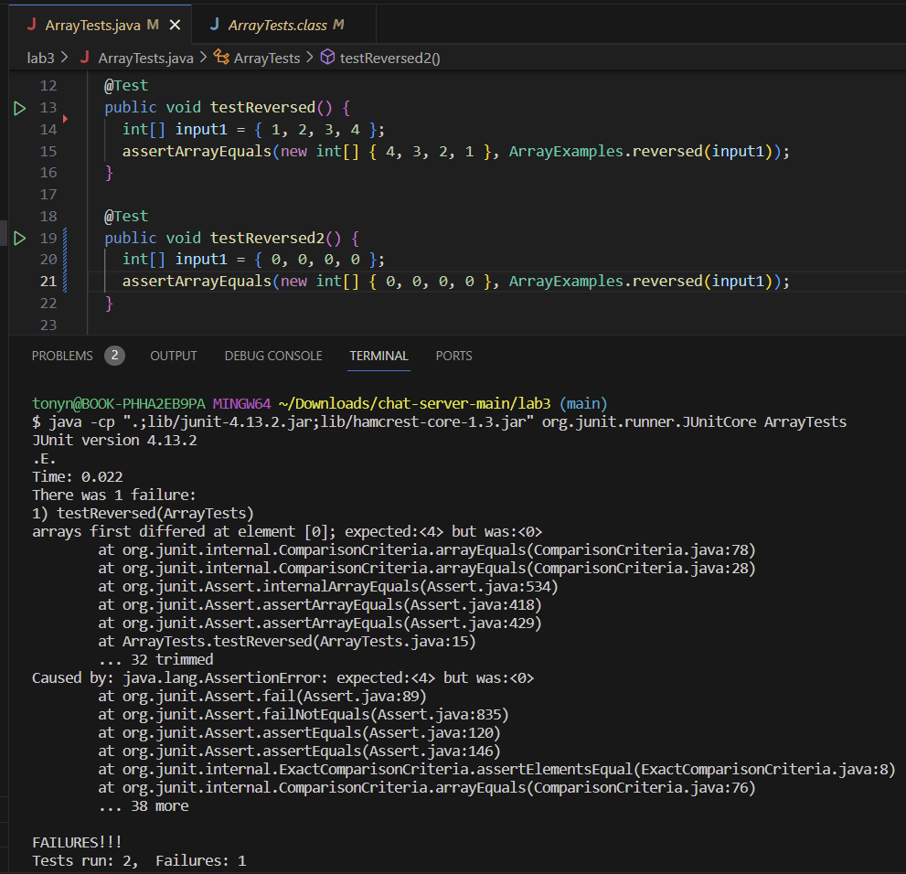

# Lab Report 3- Bugs and Commands
## Part 1- Bug with `reversed` method
Failure Inducing Input:
<br/>
```
@Test
  public void testReversed() {
    int[] input1 = {1,2,3,4};
    assertArrayEquals(new int[] {4,3,2,1}, ArrayExamples.reversed(input1));
  }
```
<br/>
Non-Failure Inducing Input:
<br/>

```
@Test
  public void testReversed2() {
    int[] input1 = { 0, 0, 0, 0 };
    assertArrayEquals(new int[] { 0, 0, 0, 0 }, ArrayExamples.reversed(input1));
  }
```

<br/>
Symptom: The method will only return an array full of zeros the size of the inputted array.
<br/>



<br/>

The Bug: The issue with the method is that it directly changes the inputted array instead of working on a dummy array.

<br/>
Before:
<br/>

```
static int[] reversed(int[] arr) {
    int[] newArray = new int[arr.length];
    for (int i = 0; i < arr.length; i += 1) {
      arr[i] = newArray[arr.length - i - 1];
    }
    return arr;
  }
```

<br/>

After:

<br/>

```
static int[] reversed(int[] arr) {
    int[] newArray = new int[arr.length];
    for (int i = 0; i < arr.length; i++) {
        newArray[i] = arr[arr.length - i - 1];
    }
    return newArray;
}
```

<br/>

This slight, yet, important change fixed the code because of 2 things. First, the for loop no longer directly changes the `arr` array (our inputted array). Instead, it changes out dummy array, `newArray` as it should. Second, it returns `newArray` instead of `arr`.

<br/>

# Part 2- Research on `grep`

1. `grep -i `

<br/>

1a.

<br/>

```
tonyn@BOOK-PHHA2EB9PA MINGW64 ~/Downloads/docsearch-main/technical/911report
$ grep -i "Gerard" *.txt
chapter-1.txt:    At 9:00, American Airlines Executive Vice President Gerard Arpey learned that communications had been lost with American 77. This was now the second American aircraft in trouble. He ordered all American Airlines flights in the Northeast that had not taken off to remain on the ground. Shortly before 9:10, suspecting that American 77 had been hijacked, American headquarters concluded that the second aircraft to hit the World Trade Center might have been Flight 77. After learning that United Airlines was missing a plane, American Airlines headquarters extended the ground stop nationwide.
chapter-13.2.txt:            55. Gerard Arpey interview (Jan. 8, 2004); Larry Wansley interview (Jan. 8, 2004);
```

<br/>


This command searches all the .txt files in the `/Downloads/docsearch-main/technical/911report` directory for "Gerard" and returns the file and line that has it. But more specifically, the "-i" part of the command makes it so that it ignores cases. Thus, if I were to use "GERARD" or "gerard" or "geRarD" I would still get the same result. I do this example in the next one. This is helpful if your looking for a certain word and don't care about the capitalization it has in the file.

<br/>

1b.

<br/>

```
tonyn@BOOK-PHHA2EB9PA MINGW64 ~/Downloads/docsearch-main/technical/911report
$ grep -i "GERARD" *.txt
chapter-1.txt:    At 9:00, American Airlines Executive Vice President Gerard Arpey learned that communications had been lost with American 77. This was now the second American aircraft in trouble. He ordered all American Airlines flights in the Northeast that had not taken off to remain on the ground. Shortly before 9:10, suspecting that American 77 had been hijacked, American headquarters concluded that the second aircraft to hit the World Trade Center might have been Flight 77. After learning that United Airlines was missing a plane, American Airlines headquarters extended the ground stop nationwide.
chapter-13.2.txt:            55. Gerard Arpey interview (Jan. 8, 2004); Larry Wansley interview (Jan. 8, 2004);
```

<br/>

This does exactly the same as described in 1a. The only difference is that I used "GERARD" instead of "Gerard". Notice how it still provides me the same files and lines like I claimed. This is helpful if I know I'm looking for the name "Gerard" but I'm not too sure on the capitalization of the name. 

<br/>

2. `grep -n`

<br/>

2a.

```
tonyn@BOOK-PHHA2EB9PA MINGW64 ~/Downloads/docsearch-main/technical/911report
$ grep -n "Gerard" *.txt
chapter-1.txt:130:    At 9:00, American Airlines Executive Vice President Gerard Arpey learned that communications had been lost with American 77. This was now the second American aircraft in trouble. He ordered all American Airlines flights in the Northeast that had not taken off to remain on the ground. Shortly before 9:10, suspecting that American 77 had been hijacked, American headquarters concluded that the second aircraft to hit the World Trade Center might have been Flight 77. After learning that United Airlines was missing a plane, American Airlines headquarters extended the ground stop nationwide.
chapter-13.2.txt:374:            55. Gerard Arpey interview (Jan. 8, 2004); Larry Wansley interview (Jan. 8, 2004);
```

<br/>

The `grep -n` command searches for "Gerard" within the working directory(/Downloads/docsearch-main/technical/911report) exactly as it is in the quotation marks without ignoring capitalization while also providing the file and line number that it can be found in the file. This is useful if I wanted to go and find the lines myself for where "Gerard" are in the given file.

<br/>

2b.

<br/>

```
tonyn@BOOK-PHHA2EB9PA MINGW64 ~/Downloads/docsearch-main/technical/911report
$ grep -n "At 9:32" *.txt
chapter-1.txt:140:    At 9:32, controllers at the Dulles Terminal Radar Approach Control "observed a primary radar target tracking eastbound at a high rate of speed." This was later determined to have been Flight 77.
chapter-1.txt:176:    At 9:32, a hijacker, probably Jarrah, made or attempted to make the following announcement to the passengers of Flight 93:"Ladies and Gentlemen: Here the captain, please sit down keep remaining sitting. We have a bomb on board. So, sit." The flight data recorder (also recovered) indicates that Jarrah then instructed the plane's autopilot to turn the aircraft around and head east.
chapter-1.txt:406:    The Command Center kept looking for American 77. At 9:21, it advised the Dulles terminal control facility, and Dulles urged its controllers to look for primary targets. At 9:32, they found one. Several of the Dulles controllers "observed a primary radar target tracking eastbound at a high rate of speed" and notified Reagan National Airport. FAA personnel at both Reagan National and Dulles airports notified the Secret Service. The aircraft's identity or type was unknown.
chapter-1.txt:460:    At 9:32, a third radio transmission came over the frequency:"Keep remaining sitting. We have a bomb on board." The controller understood, but chose to respond: "Calling Cleveland Center, you're unreadable. Say again, slowly." He notified his supervisor, who passed the notice up the chain of command. By 9:34, word of the hijacking had reached FAA headquarters.
chapter-9.txt:899:            At 9:32, a senior chief radioed all units in the North Tower to return to the lobby,
```

<br/>

This is another example of the `grep -n` command in use exactly as in the previous example. Provides file name, line, and line number that contains "At 9:32". This is helpful if I wanted to know what happened at 9:32 during the 911 attack, find the line number where the .txt file starts talking about it and I can read what happened after 9:32.

<br>

3. `grep -c`

<br/>

3a.

<br/>


 


