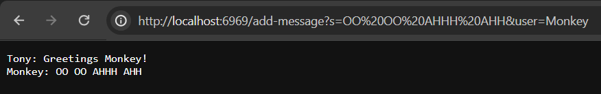
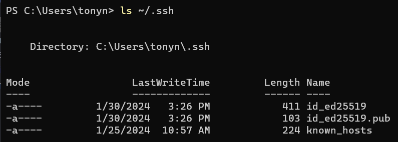
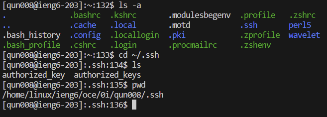
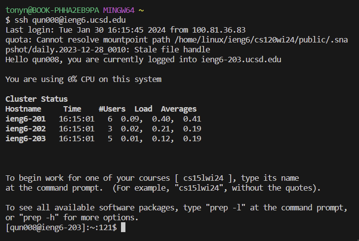

# CSE 15L Lab Report 2
## Part 1
**Code for ChatServer:**
```
import java.io.IOException;
import java.net.URI;
import java.util.ArrayList;
import java.util.List;

class Handler implements URLHandler {
   
    List<String> entireChat = new ArrayList<>();

    public String handleRequest(URI url) {

        if (url.getPath().contains("/add-message")) {
            String[] parameters = url.getQuery().split("&");
            String name = null;
            String message = null;

            for (int i = 0; i < parameters.length; i++) {
                String[] curr = parameters[i].split("=");
                if (curr[0].equals("s")) {
                    message = curr[1];
                } else if (curr[0].equals("user")) {
                    name = curr[1];
                }
                if (message != null && name != null) {
                    String TheMessages = name + ": " + message + "\n";
                    entireChat.add(TheMessages);
                }
            }

            StringBuilder finalChat = new StringBuilder();
            for (String chatMessage : entireChat) {
                finalChat.append(chatMessage);
            }

            return finalChat.toString();
        }
        return "404 Not Found!";
    }
}

class ChatServer {
    public static void main(String[] args) throws IOException {
        if (args.length == 0) {
            System.out.println("Missing port number! Try any number between 1024 to 49151");
            return;
        }

        int port = Integer.parseInt(args[0]);

        Server.start(port, new Handler());
    }
}
```
**Screenshot 1:**
<br/>

<br/>
From this screenshot there are methods, arguments, and values are being used in my code. The method that was called was my `handleRequest` method. The relevant argument was `URI url` and from this, there are fields such as `name` and `message`. `name` and `message` are derived from the `curr` field which splitted the given argument, which helped assign values to the respective fields. From this specific request, the `name` field was changed from `null` to `Tony` and the `message` field was changed from `null` to `Greetings Monkey!`
<br/>
<br/>
**Screenshot 2:**
<br/>

From this screenshot, the method `handleRequest` is called as it takes in the argument `URI url` and changes the fields `name` and `messages` to `Monkey` and `OO OO AHHH AHH`, respectively. Using `name` and `message`, it creates `TheMessages` which is then added to `entireChat`. Lastly, `finalChat` takes in everything from `entireChat` and return the entire conversation.
<br/>
## Part 2

**Screenshot of absolute path to private key**
<br/>

<br/>
**Screenshot of absolute path to public key**
<br/>

<br/>
**Screenshot of logging into `ieng6` account without password**
<br/>



